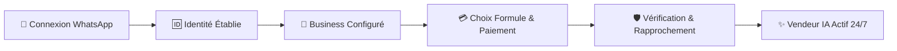

# 🚀 ROADMAP STRATÉGIQUE : VENDEUR IA — LE NOUVEL ESPRIT

> **Positionnement produit :** *« Votre vendeur IA sur WhatsApp. »*  
> **Philosophie :** Zéro friction, 100% WhatsApp-Native, simplicité radicale pour le commerçant, robustesse & sécurité sous le capot.

---

## 🎯 Le Nouveau Paradigme Produit

---

## 📊 Tableau de Bord des Jalons (Roadmap 2026)

| Phase | Intitulé & Focus | Statut | Objectif & Livrables Clés |
| :---: | :--- | :---: | :--- |
| **Phase 1** | **Authentification WhatsApp-Native & Identité Idempotente** | 🟢 **ACTIF** | Connexion 1-clic mobile, QR Code desktop, reconnaissance de numéro & création automatique de compte. |
| **Phase 2** | **Onboarding Ultraléger & Configuration Business** | 🟡 **EN COURS** | Configuration boutique en 30s chrono, pas de formulaires lourds, IA Vision (Photo-to-Product). |
| **Phase 3** | **Architecture de Paiement Provider-Agnostic** | 🚀 **PROCHAINE** | Interface unifiée (`ManualMobileMoney`, `Lygos`, `CinetPay`, `Paystack`) avec gestion des `PaymentIntent`. |
| **Phase 4** | **Moteur de Vérification des Paiements & Anti-Fraude** | 🛡️ **PLANIFIÉ** | Score de confiance multi-signaux, détection de doublons, réconciliation automatique & revue admin. |
| **Phase 5** | **Activation Idempotente & Cycle de Vie Abonnement** | ⚡ **PLANIFIÉ** | Transition instantanée `Mode Découverte` ➡️ `Actif 24/7`, notifications WhatsApp, gestion & upgrade. |
| **Phase 6** | **Cockpit Marchand & Dashboard Post-Abonnement** | 📊 **PLANIFIÉ** | Statut WhatsApp temps réel, bascule Pause/Actif explicite, métriques commerciales & Human Takeover. |
| **Phase 7** | **Canal WhatsApp Opérationnel & Notifications** | 💬 **PLANIFIÉ** | Notifications transactionnelles et alertes marchands directement sur WhatsApp. |
| **Phase 8** | **Audit de Sécurité, Performances & Déploiement** | 🔒 **PLANIFIÉ** | Validation du build global, vérification des middlewares d'authentification et résilience réseau. |

---

## 🛠️ Détail des Phases d'Implémentation

### 📱 PHASE 1 : Authentification WhatsApp-Native & Identité
- [x] **Connexion Mobile 1-Clic** via lien direct WhatsApp (validation de concordance stricte).
- [x] **Connexion Ordinateur** par QR Code interactif synchronisé via WebSockets.
- [x] **Distinction Architecturale** :
  - `User Identity` (Propriétaire du compte)
  - `WhatsApp Business Channel` (Ligne commerciale de vente)
- [x] **Idempotence & Restauration** : Reconnaissance instantanée du numéro sans recréation de compte.

### 🏪 PHASE 2 : Onboarding & Configuration Express
- [x] Saisie minimale : Nom de la boutique, catégorie, devise/pays par défaut.
- [x] Ajout de produits express par **IA Vision** (Photo-to-Product multimodal).
- [x] Accès direct au **Mode Découverte gratuit** (test dans le simulateur sans blocage).

### 💳 PHASE 3 : Architecture Paiement Provider-Agnostic
- [ ] **Modélisation `PaymentIntent`** :
  - `id`, `userId`, `businessId`, `planId`, `amount`, `currency`, `provider`, `status`, `confidenceScore`, `auditTrail`.
- [ ] **Couche d'abstraction `PaymentProvider`** :
  - `ManualMobileMoneyProvider` (Wave, Orange Money, MTN, Moov)
  - `LygosProvider` & `CinetPayProvider`
  - `PaystackProvider` (Cartes & options bancaires)
- [ ] **Sélection transparente des offres** : Affichage clair du montant, de la devise locale et du moyen de paiement avant validation.

### 🛡️ PHASE 4 : Moteur de Vérification des Paiements & Rapprochement
- [ ] **Moteur d'évaluation multi-signaux** :
  - Concordance montant attendu / reçu
  - Concordance numéro émetteur / identité
  - Fenêtre temporelle de validité
  - Unicité de l'identifiant de transaction (anti-rejeu)
- [ ] **Calcul du Score de Confiance** :
  - Confiance haute (>90%) ➡️ Auto-validation & activation instantanée.
  - Confiance moyenne/faible ➡️ File d'attente **Admin Review**.
- [ ] **Interface d'administration dédiée** : Validation manuelle en 1 clic avec audit trail complet.

### ⚡ PHASE 5 : Cycle de Vie & Activation de l'Abonnement
- [ ] **Activation Idempotente** : `Payment CONFIRMED` ➡️ `Subscription ACTIVE`.
- [ ] **Gestion des États** :
  - 🟡 *Mode Découverte* (Gratuit / Simulateur)
  - 🟢 *En Vente 24h/24* (Abonnement Actif)
  - ⏸️ *En Pause* (WhatsApp connecté, IA en veille)
- [ ] **Gestion des Forfaits** : Évolution de formule fluide, renouvellement et historique des paiements.

### 📊 PHASE 6 : Cockpit Marchand & Dashboard Épuré
- [ ] Suppression définitive des doubles cadres et des marges excessives (Mobile First).
- [ ] Affichage du statut en direct : `🟢 +225 XX XX XX XX Connecté - Vendeur IA Actif`.
- [ ] Bouton d'interrupteur simple : *Mettre en pause* / *Reprendre les ventes*.
- [ ] Déconnexion sécurisée : Distinction claire entre fermeture de session écran et arrêt du service IA.

---

## 🔒 Principes d'Ingénierie & Sécurité Non-Négociables

1. **Zéro Compromis Sécurité** : Pas d'activation sur simple capture d'écran non vérifiée.
2. **Idempotence Système** : Tout webhook ou événement reçu plusieurs fois ne doit être exécuté qu'une seule fois.
3. **Résilience Locale** : Fonctionnement sans accroc sur connexions mobiles africaines (3G/4G/Offline-first).
4. **Langage Humain** : Bannir tout jargon technique (`OAuth`, `Webhook`, `Bearer Token`) des interfaces commerçants.
