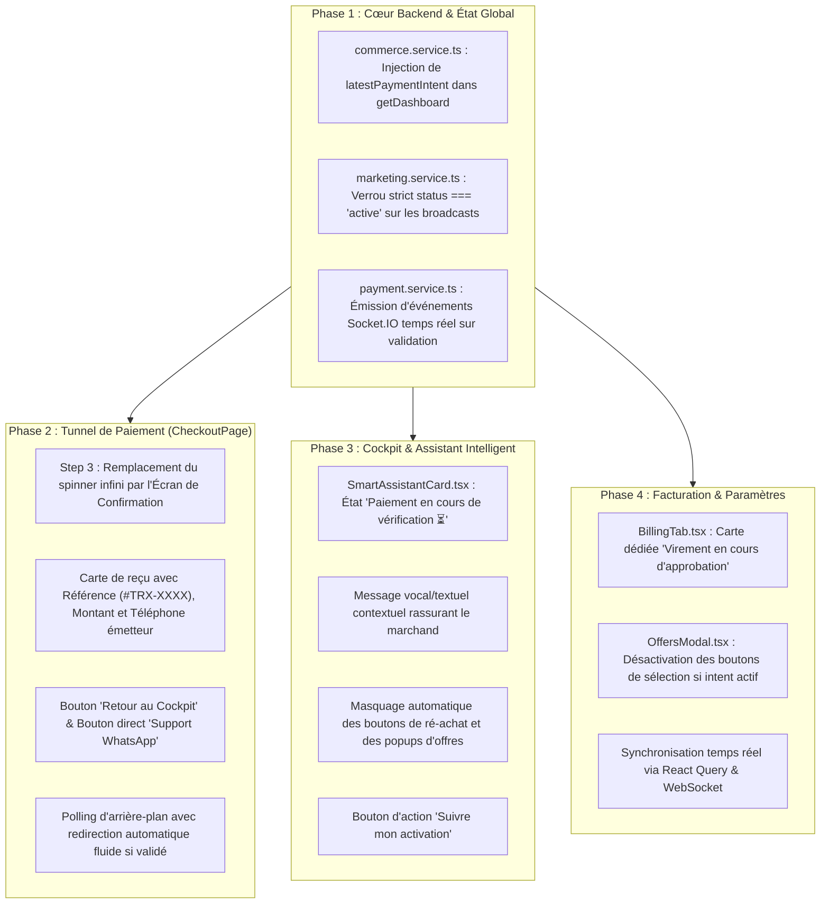

# 🗺️ ROADMAP TECHNIQUE & EXPÉRIENCE UTILISATEUR : PAIEMENT DE BOUT EN BOUT & GATING INTELLIGENT

---

## 🎯 OBJECTIFS STRATÉGIQUES
1. **Zéro angle mort sur le tunnel de paiement** : Du clic d'envoi du transfert Mobile Money jusqu'à l'activation 24h/24 par l'IA.
2. **Réassurance et clarté immédiate** : Dès qu'un paiement est soumis, le marchand reçoit sa référence, son statut et un accès direct au support sans être bloqué sur un spinner infini.
3. **Suppression des doublons d'achat** : Empêcher le marchand de repayer ou de voir des popups promotionnelles lorsqu'une transaction est déjà en cours de vérification.
4. **Protection stricte des ressources IA (Mode Découverte)** : Garantie que les utilisateurs gratuits bénéficient d'un onboarding fluide sans consommer de tokens WhatsApp réels ni lancer de campagnes non autorisées.

---

## 🏗️ ARCHITECTURE DES PHASES D'EXÉCUTION



---

## 📋 DÉTAIL TECHNIQUE MINUTIEUX PAR PHASES

### 🔹 Phase 1 : Cœur Backend & Sécurisation des Ressources (`apps/api`)

1. **Injection de l'Intent Actif dans `getDashboard` (`apps/api/src/modules/commerce/commerce.service.ts`)** :
   * Requêter `PaymentIntentModel.findOne({ userId: ownerId, status: { $in: ['under_verification', 'pending'] } }).sort({ createdAt: -1 })`.
   * Inclure `latestPaymentIntent: { _id, reference, amount, currency, status, paymentMethod, senderPhoneNumber, createdAt }` dans l'objet de retour.
2. **Protection de la Route de Diffusion Marketing (`apps/api/src/services/marketing.service.ts`)** :
   * Vérification systématique dans `launchBroadcast` :
     ```typescript
     if (merchant.subscription?.status !== "active") {
       throw new Error("Les campagnes de diffusion WhatsApp nécessitent un forfait Vendeur IA actif.");
     }
     ```
3. **Sécurisation du Mode Découverte (`apps/api/src/modules/whatsapp/whatsapp.service.ts`)** :
   * Maintien du verrou à la ligne 635 garantissant qu'aucune requête IA n'est exécutée pour les marchands non abonnés recevant des messages sur leur numéro WhatsApp réel.
   * Encadrement strict du simulateur IA pour éviter toute saturation.

---

### 🔹 Phase 2 : Refonte du Tunnel de Paiement (`apps/web/src/features/billing/CheckoutPage.tsx`)

1. **Suppression du Spinner Bloquant** :
   * Quand `handleSubmitProof` est validé et que l'intent passe en `under_verification`, l'interface affiche une carte complète de prise en compte.
2. **Composants de l'Écran de Reçu** :
   * **En-tête de Statut** : Icône animée émeraude + *"Votre transfert a bien été enregistré !"*.
   * **Fiche Récapitulative** :
     * Référence : `#TRX-XXXXXXXX` (bouton copier).
     * Montant déclaré : `X FCFA`.
     * Numéro émetteur : `+225 XX XX XX XX`.
     * Délai estimé de traitement : `10 à 30 minutes`.
   * **Actions Claires** :
     * Bouton principal : **"Aller à mon tableau de bord"** (active l'accès au cockpit en attendant).
     * Bouton secondaire : **"Assistance WhatsApp"** (ouvre un chat pré-rempli avec la référence).
3. **Maintien du Polling Discret** :
   * Si la validation survient pendant que l'utilisateur est encore sur la page, toast de succès instantané et redirection automatique.

---

### 🔹 Phase 3 : Intelligence de l'Assistant Cockpit (`apps/web/src/features/dashboard/components/SmartAssistantCard.tsx`)

1. **Nouvel État Dédié : `isUnderVerification`** :
   * Déclenché quand `dashboard?.latestPaymentIntent?.status === "under_verification"`.
2. **Thématique Visuelle & Voix de l'Assistant** :
   * **Badge** : `Vérification en cours ⏳` (Bleu cyan / Émeraude).
   * **Message Personnalisé** :
     > *"Votre règlement de [Montant] [Devise] (Réf: [Référence]) est en cours de validation par notre équipe. Votre Vendeur IA 24h/24 sera activé dès confirmation !"*
   * **Bouton d'Action Primaire** : `Suivre mon activation (Réf : #XXX)` ou `Contacter le support`.
   * **Suppression des Biais** : Retrait complet des boutons *"Activer le Forfait 24h/24"* qui incitaient à repayer.
3. **Blocage des Modals Intrusives** :
   * Désactivation automatique de `OffersModal` et du popup de bienvenue si un paiement est en cours.

---

### 🔹 Phase 4 : Facturation & Paramètres (`apps/web/src/features/settings/components/BillingTab.tsx`)

1. **Carte d'Information de Transaction en Cours** :
   * Affichage en tête d'onglet d'un encart dédié :
     * Canal utilisé (Wave, Orange Money, MTN, Moov, Carte, Virement).
     * Date de soumission et référence unique.
     * Statut dynamique avec puce pulsante.
2. **Désactivation Sécurisée des Boutons d'Achat** :
   * Les boutons de sélection d'offres affichent *"Paiement en attente de validation"* et sont désactivés pour éviter tout double débit accidentel.
