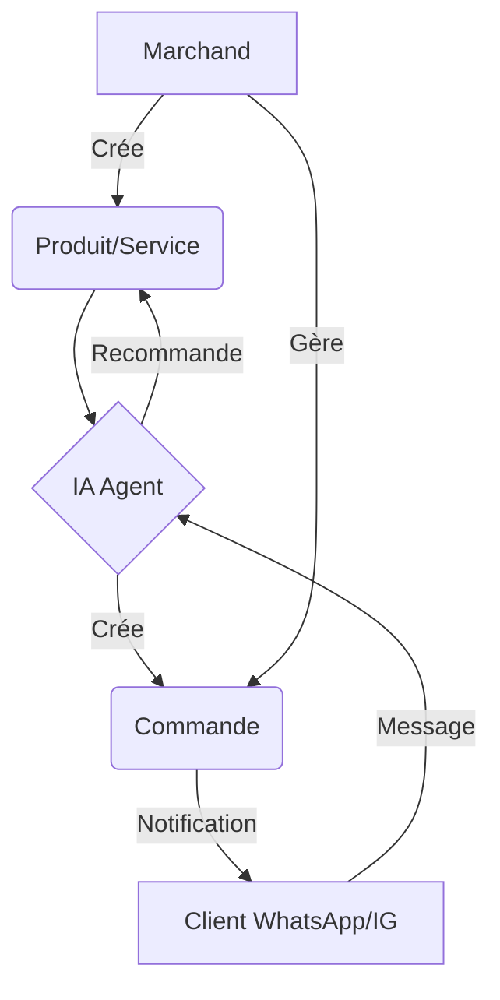

# Architecture Technique - Module Commerce 🏗️

Ce document décrit l'organisation technique de la gestion des produits, services et commandes.

## Modèles de Données (Mongoose)

### 1. CommerceMerchant
Stocke les paramètres du marchand, sa catégorie (fashion, food, services, etc.) et ses configurations de canaux (WhatsApp, Instagram).

### 2. CommerceProduct
- `isService`: Boolean permettant de distinguer les prestations.
- `images`: Tableau d'URLs.
- `aiMetadata`: Tags et légendes générés.

### 3. CommerceOrder
- Suit les items, le montant total, et les statuts de paiement/livraison.
- Lié à un `CommerceCustomer` et un `CommerceMerchant`.

## Flux de Données Principal

## Points d'Entrée API Clés (`/api/commerce`)

- `POST /products/vision`: Analyse d'image via Gemini Vision.
- `POST /products/:id/caption`: Génération de copywriting marketing.
- `POST /orders`: Création manuelle de commande.
- `PATCH /orders/:id`: Mise à jour des statuts (déclenche l'envoi de reçu via `CommerceService`).

## Adaptation Intelligente (Frontend)

L'UI React utilise un système de configurations par catégorie (`BUSINESS_CONFIGS`) pour mapper les labels et icônes :
- `fashion` -> "Article", "Stock"
- `services` -> "Prestation", "Disponibilité"
- `food` -> "Plat", "Menu"
