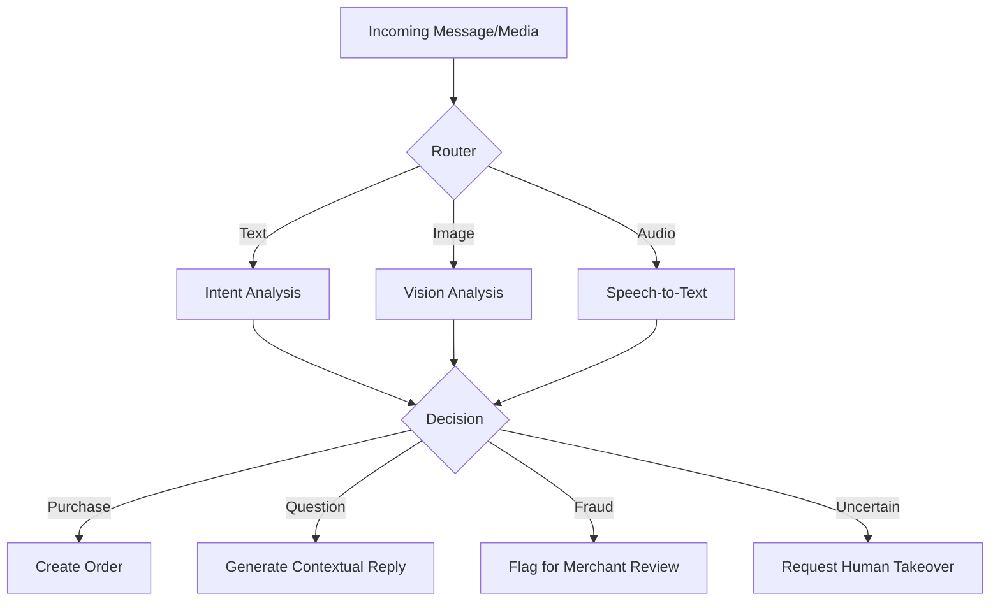

# 🧠 AI Orchestration & The Brain

The "Brain" is the core intelligence layer of Vendeur IA. It is not just a chatbot, but a multi-modal agent capable of vision, audio processing, and autonomous decision-making.

## 🤖 Multi-Model Strategy

We use **Google Gemini 1.5** (Pro and Flash) as the primary engine, with fallbacks to other providers (Groq/OpenAI) via `ai-provider.ts`.

### 1. Sales Agent (`ai-agent.service.ts`)
- **Role**: Handles customer conversations.
- **Context**: Injects merchant identity, product catalog, and delivery zones.
- **Tone**: Localized (Nouchi, Wolof, French) based on the merchant's "Tone of Voice" setting.
- **Autonomous Actions**: Can trigger order creation (`[[ACTION_CREATE_ORDER]]`) when it detects a firm purchase intent.

### 2. AI Vision (`commerce.service.ts`)
- **Role**: Transforms photos into digital products.
- **Input**: User uploads/scans an image.
- **Output**: Structured JSON containing Name, Suggested Price, Description, and Tags.
- **Feature**: Supports **Batch Photo-to-Product** (scanning a whole shelf).

### 3. Payment Shield (`payment-shield.service.ts`)
- **Role**: Fraud detection for Mobile Money receipts.
- **Logic**:
    - **OCR**: Extracts transaction ID, amount, and recipient.
    - **Anti-Forgery**: Analyzes image for Photoshop artifacts or AI-generated receipts.
    - **Scoring**: Returns a confidence score (0-100%).

---

## 🏗️ The Decision Engine Flow

## 📝 Prompt Engineering Standards

Prompts are stored and managed with strict local context. Every prompt MUST include:
1. **Merchant Persona**: "You are the digital seller for [Store Name]."
2. **Geographical Constraints**: Delivery zones and local currency (FCFA).
3. **Safety Rails**: Do not hallucinate stock; do not accept payments outside configured channels.
