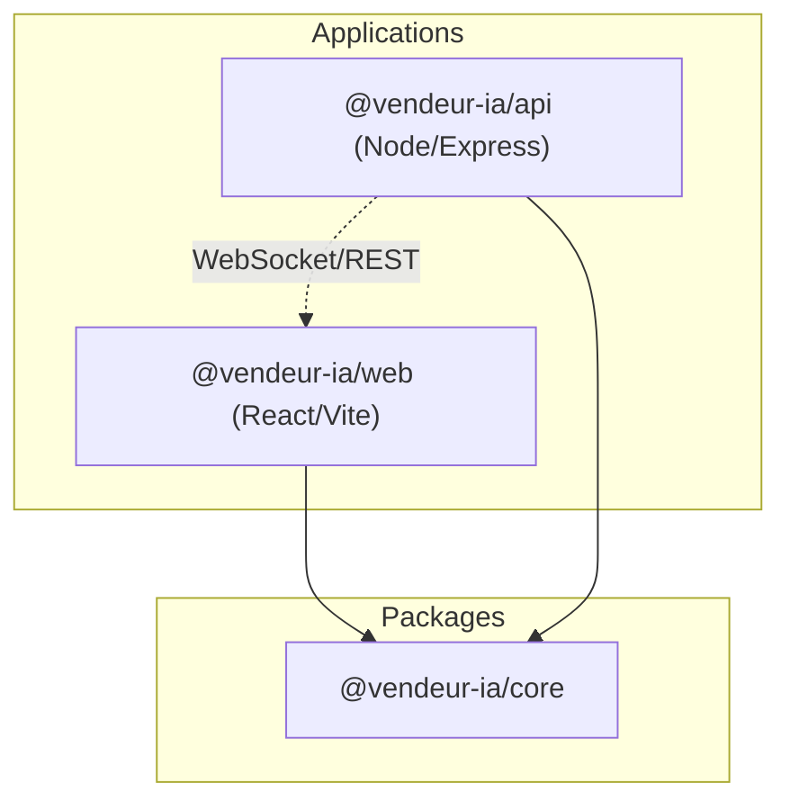
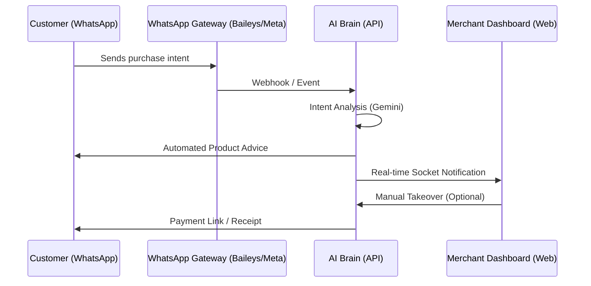

# 🏗️ System Overview - Vendeur IA OS

Vendeur IA is a specialized Operating System (OS) designed for Social Commerce in the African market. It bridges the gap between traditional retail and conversational commerce by leveraging AI to manage sales directly within messaging platforms like WhatsApp, Instagram, and TikTok.

## 🏢 Monorepo Architecture

The project is managed as a **Turborepo** monorepo, ensuring strict separation of concerns and code sharing.

### 📦 Components
- **`@vendeur-ia/core`**: Contains Zod schemas, data contracts, and shared validation logic.
- **`@vendeur-ia/api`**: The "Brain" of the system. Handles AI orchestration, payment processing, WhatsApp session management, and business logic.
- **`@vendeur-ia/web`**: A mobile-first, high-performance React application built with Framer Motion for a premium "app-like" experience.

---

## 🔄 Core Data Flow

Vendeur IA operates on an **Event-Driven Architecture** for real-time commerce.

---

## 🛠️ Technology Stack

| Layer | Technology |
| :--- | :--- |
| **Language** | TypeScript (Strict Mode) |
| **Backend** | Node.js, Express, MongoDB (Mongoose) |
| **Frontend** | React, Vite, Tailwind CSS, Framer Motion |
| **State Management** | TanStack Query (React Query) |
| **AI Engine** | Google Gemini 1.5 Pro/Flash |
| **Real-time** | Socket.io |
| **Payments** | Paystack (Subscription & Local MM) |
| **Communication** | Baileys (WA), Meta Graph API (IG/FB) |
