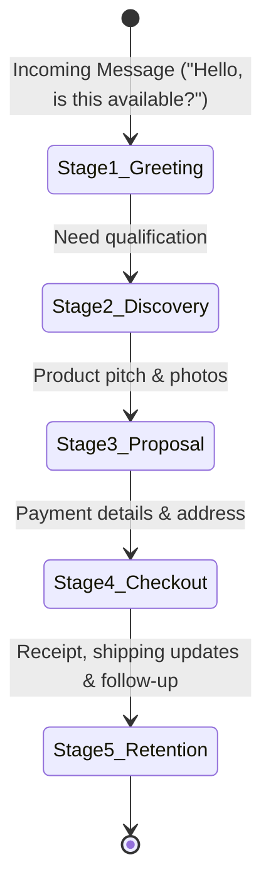

# 🛍️ Conversational Sales Funnel - Vendeur IA OS

This document details the stages of the automated conversational commerce funnel across WhatsApp, Instagram, and TikTok.

---

## 🎯 1. The 5 Funnel Stages

---

## 💬 2. Stage Breakdown

### Stage 1: Greeting & Intent Detection
- Language and buyer intent identification in sub-second response time.
- Welcoming message customized with merchant's brand personality.

### Stage 2: Discovery & Stock Verification
- Qualifies sizes, colors, quantities, and delivery city.
- Live database queries to ensure real-time product availability.

### Stage 3: Value Pitch & Recommendation
- Sends high-resolution product media, persuasive descriptions, and localized pricing.
- Resolves common buyer objections (shipping speed, product authenticity).

### Stage 4: Checkout & Payment Collection
- Collects customer name, delivery neighborhood, and landmark details.
- Proposes merchant-configured payment options (Wave, Orange Money, MTN, COD).
- Instant verification via **PaymentShield** upon receipt upload.

### Stage 5: Digital Receipt & Automated Follow-Up
- Sends an itemized digital receipt (text and PDF).
- Triggers gentle automated follow-up reminders for abandoned checkout intents.
