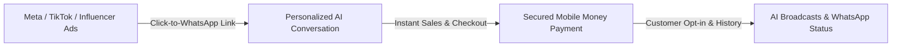

# 📢 Social Commerce & Growth Strategy - Vendeur IA OS

This document details the marketing strategy, market positioning, and conversion growth levers for Social Commerce in Africa and emerging markets.

---

## 🎯 1. Market Opportunity

Across Sub-Saharan Africa and francophone markets:
- **WhatsApp is the Primary Internet Browser**: Over 80% of informal and direct-to-consumer commerce occurs via instant messaging.
- **Traditional Checkout Friction**: High bounce rates on classic e-commerce storefronts due to lack of immediate trust and impersonal forms.
- **Instant Response Imperative**: Buyers asking *"How much?"* or *"Is this available?"* purchase from whoever answers first with accurate, helpful information.

---

## 🚀 2. Growth & Retention Pillars

### 1. Click-to-WhatsApp Funnel
- Direct ad traffic routing to merchant WhatsApp channels.
- Sub-second first response with relevant product information and instant stock check.

### 2. AI Creative Studio
- Automated generation of promotional posters tailored for WhatsApp Statuses and Stories.
- Culturally relevant, engaging marketing copy adapted to local slang and buying habits.

### 3. Smart Retargeting Broadcasts
- Automatic customer segmentation based on purchase frequency and average basket size.
- Targeted promotional campaigns sent via WhatsApp without triggering spam flags.
