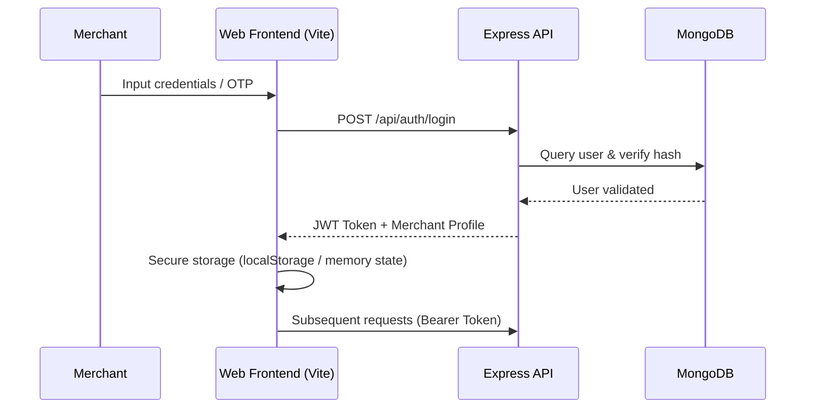
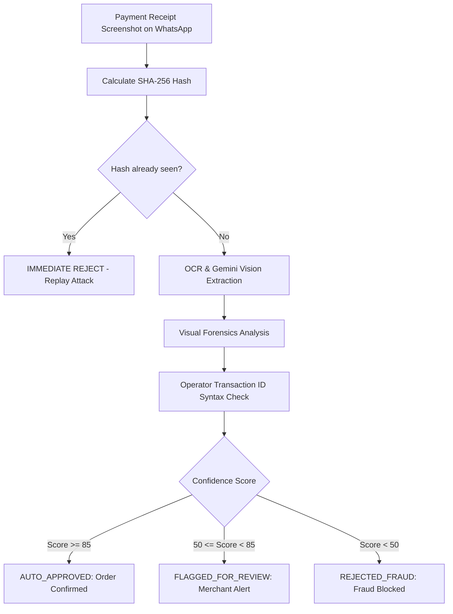

# 🛡️ Security & Compliance - Vendeur IA OS

This document details the security architecture, authentication protocols, merchant data isolation, and anti-fraud mechanisms implemented across Vendeur IA.

---

## 🔐 1. Authentication & Session Management

Vendeur IA provides frictionless authentication designed for mobile-first African commerce (phone/WhatsApp or email/password).

### Authentication Mechanisms
- **Phone Number Authentication (OTP / WhatsApp)**: Real-time verification with short-lived secured tokens (5 minutes expiration).
- **Email / Password Authentication**: Strong password hashing using `bcrypt` (10 salt rounds).
- **JWT Access Tokens**:
  - `Access Token`: HMAC-SHA256 signed with 24-hour expiration.
  - Secured transport via standard HTTP header `Authorization: Bearer <token>`.
  - Strict middleware validation in [`apps/api/src/middleware/authenticate.ts`](file:///C:/Users/Franck/web-apps/vendeur-ia/apps/api/src/middleware/authenticate.ts).

---

## 🏢 2. Multi-Tenant Data Isolation

Each merchant store is strictly and logically isolated:

1. **Mandatory `merchantId` Reference**:
   - All operational models (`Product`, `Order`, `Conversation`, `Knowledge`, `Customer`, `Transaction`) include an indexed `merchantId` foreign key.
2. **Controller & Service Level Enforcement**:
   - The merchant identifier is extracted directly from the authenticated JWT token (`req.user.merchantId` or `req.user.userId`).
   - Cross-tenant queries are disallowed unless explicit admin permissions are present (`role === "founder"` or `role === "admin"`).
3. **Audit Log & Traceability**:
   - Sensitive actions (price edits, gateway activations, refunds) are recorded in [`AuditLogModel`](file:///C:/Users/Franck/web-apps/vendeur-ia/apps/api/src/modules/commerce/audit-log.model.ts).

---

## 🛡️ 3. PaymentShield Forensic™ (Anti-Fraud for Mobile Money)

The **PaymentShield Forensic** system protects merchants against forged Mobile Money payment screenshots (Wave, Orange Money, MTN Moov).

---

## 📲 4. WhatsApp Gateways & Media Security

1. **Baileys Multi-Device Sessions**:
   - Authentication keys and multi-device credentials are encrypted and stored in a private non-public directory (`storage/whatsapp-sessions/`).
2. **Meta Cloud API (Official Numbers)**:
   - Strict webhook secret validation via Meta verification token (`HUB_VERIFY_TOKEN`).
   - Cryptographic `X-Hub-Signature-256` validation on all incoming webhooks.
3. **Media Sanitation**:
   - Upload restrictions to allowed MIME types (`image/jpeg`, `image/png`, `image/webp`, `audio/ogg`, `audio/mp4`).
   - Max file size enforcement (10 MB per file).
