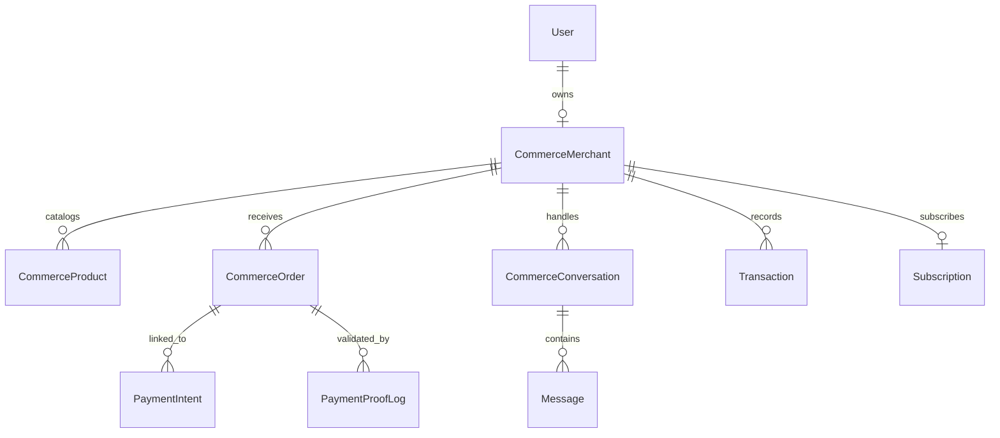

# 🗄️ Database & Data Models - Vendeur IA OS

This document presents the **MongoDB (Mongoose)** data architecture of Vendeur IA, key entity modeling, and business relationships.

---

## 📐 1. Schema Overview

---

## 📋 2. Core Models

### 👤 User (`User`)
- **File**: [`apps/api/src/modules/auth/user.model.ts`](file:///C:/Users/Franck/web-apps/vendeur-ia/apps/api/src/modules/auth/user.model.ts)
- **Role**: Manages credentials, identity, access control (`merchant`, `founder`, `admin`), and authentication methods (email, phone, WhatsApp).

### 🏪 Merchant (`CommerceMerchant`)
- **File**: [`apps/api/src/modules/commerce/commerce.model.ts`](file:///C:/Users/Franck/web-apps/vendeur-ia/apps/api/src/modules/commerce/commerce.model.ts)
- **Essential Fields**:
  - `ownerId`: User reference.
  - `businessName` & `category`: Store brand name and category (fashion, beauty, electronics, etc.).
  - `country`, `city`, `currency`: Geolocation and currency settings (e.g. `CI`, `Abidjan`, `XOF`).
  - `aiSettings`: Agent tone, response style, formality level, and auto-reply toggle.
  - `paymentChannels`: Active payment channels (Wave, Orange Money, MTN, Moov, Cash On Delivery).

### 📦 Product (`CommerceProduct`)
- **File**: [`apps/api/src/modules/commerce/commerce.model.ts`](file:///C:/Users/Franck/web-apps/vendeur-ia/apps/api/src/modules/commerce/commerce.model.ts)
- **Essential Fields**:
  - `merchantId`: Associated merchant.
  - `name`, `description`, `price`, `compareAtPrice`: Pricing and descriptive details.
  - `stock`: Current inventory count (auto-decremented upon confirmed sale).
  - `images`: Image gallery URLs.
  - `isActive`: Toggle for AI catalog visibility.

### 🛒 Order (`CommerceOrder`)
- **File**: [`apps/api/src/modules/commerce/order.model.ts`](file:///C:/Users/Franck/web-apps/vendeur-ia/apps/api/src/modules/commerce/order.model.ts)
- **Statuses**: `pending`, `confirmed`, `paid`, `shipped`, `delivered`, `cancelled`.
- **Fields**: Order items, quantities, customer details, delivery location, total amount, and payment verification status.

---

## ⚡ 3. Performance & Indexing Strategy

- Compound index `{ merchantId: 1, createdAt: -1 }` on all operational collections.
- Unique index `{ ownerId: 1 }` on `CommerceMerchant`.
- Index `{ customerPhone: 1, merchantId: 1 }` on conversations for instant webhook dispatching.
