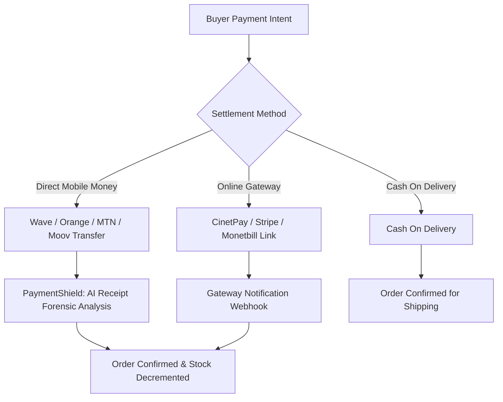

# 💳 Payment Integrations & Mobile Money - Vendeur IA OS

This document explains the payment processing architecture, African and global currency handling, and automated checkout flows on Vendeur IA.

---

## 🌍 1. Supported Currencies & Conversion Rates

| Currency | Symbol | Primary Market | Merchant Rounding |
| :--- | :--- | :--- | :--- |
| **XOF** | CFA | Côte d'Ivoire, Senegal, Mali, Burkina Faso, Togo, Benin, Niger | 500 CFA |
| **XAF** | FCFA | Cameroon, Gabon, Congo, Chad, Central African Republic | 500 FCFA |
| **GNF** | FG | Guinea | 5,000 FG |
| **CDF** | FC | Democratic Republic of Congo | 500 FC |
| **NGN** | ₦ | Nigeria | 100 ₦ |
| **GHS** | GH₵ | Ghana | 5 GH₵ |
| **EUR / USD** | € / $ | Diaspora / International | 1 € / 1 $ |

---

## 🔄 2. Payment Methods Flow

### A. Direct Mobile Money (P2P Transfers)
1. Buyer receives merchant's payment details (e.g. Wave or Orange Money number).
2. Buyer completes transfer and sends the screenshot receipt or confirmation SMS into the WhatsApp chat.
3. **PaymentShield** instantly extracts amount, date, operator, and transaction ID, then marks the order as paid.

### B. Automated Payment Links & Gateways
- Generates dynamic secure payment links with unique reference (`VIA-XXXX-XXXX`).
- Webhook endpoints verify cryptographic signatures and emit Socket.io updates in real time.

### C. Cash On Delivery (COD)
- AI agent collects shipping address, city neighborhood, and landmarks.
- Order is logged with `pending_cod` and instantly alerted to the merchant.
