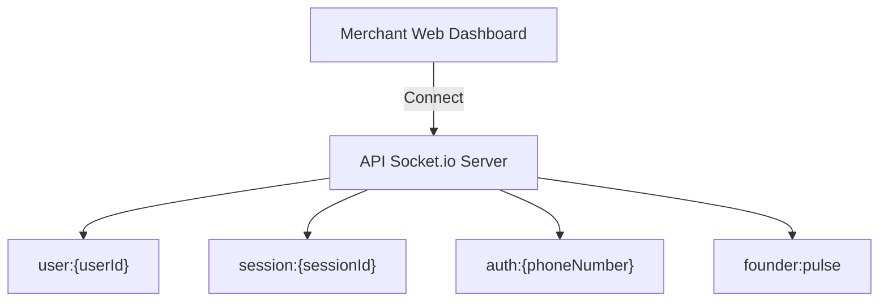

# ⚡ Real-Time & WebSockets - Vendeur IA OS

This document describes the WebSocket architecture powered by **Socket.io** for real-time messaging, instant sale notifications, and human takeover.

---

## 📡 1. Room Isolation Architecture

### Core Rooms:
- **`user:{userId}`**: Delivers private merchant events (new incoming order, message received, payment validated).
- **`session:{sessionId}`**: Used for Web Chat and online/offline presence tracking.
- **`auth:{phoneNumber}`**: Enables instant QR code and OTP authentication synchronization across devices.
- **`founder:pulse`**: High-priority real-time room for founders to monitor platform traffic and system events.

---

## 🔔 2. Main Socket Events

| Event | Direction | Payload Type | Description |
| :--- | :--- | :--- | :--- |
| `message:new` | Server ➔ Client | `IMessage` | New incoming chat message from WhatsApp/Instagram |
| `order:new` | Server ➔ Client | `IOrder` | New order created and calculated |
| `payment:proof_analyzed` | Server ➔ Client | `ForensicResult` | PaymentShield forensic analysis result |
| `takeover:toggle` | Client ➔ Server | `{ conversationId, isHuman }` | Toggles human manual takeover or AI autonomy |
| `copilot:alert` | Server ➔ Client | `{ text, actions }` | Copilot AI proactive suggestion |

---

## 🛑 3. Human Takeover Protocol

1. Merchant clicks **"Take Over"** in the Web Inbox.
2. `takeover:toggle` with `{ isHuman: true }` is dispatched to the backend.
3. Database sets `isHandledByHuman = true` for the active conversation thread.
4. Autonomous AI agent pauses automated replies on this conversation.
5. The merchant can hand control back to the AI at any time with a single click.
