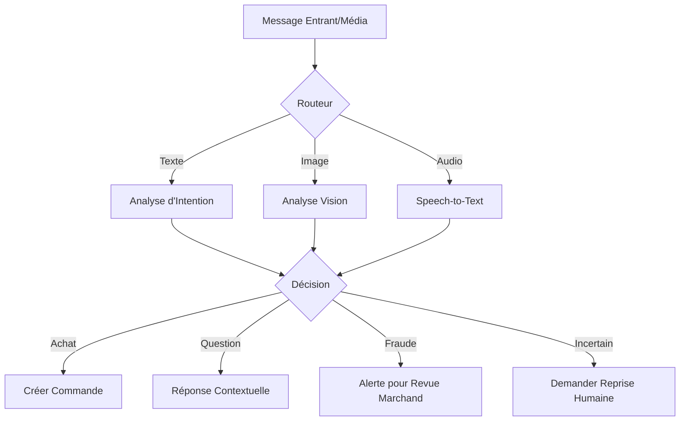

# 🧠 Orchestration de l'IA & Le Cerveau

Le "Cerveau" est la couche d'intelligence centrale de Vendeur IA. Ce n'est pas seulement un chatbot, mais un agent multi-modal capable de vision, de traitement audio et de prise de décision autonome.

## 🤖 Stratégie Multi-Modèles

Nous utilisons **Google Gemini 1.5** (Pro et Flash) comme moteur principal, avec des solutions de repli (Groq/OpenAI) via `ai-provider.ts`.

### 1. Agent de Vente (`ai-agent.service.ts`)
- **Rôle** : Gère les conversations clients.
- **Contexte** : Injecte l'identité du marchand, le catalogue de produits et les zones de livraison.
- **Ton** : Localisé (Nouchi, Wolof, Français) basé sur le réglage "Ton de Voix" du marchand.
- **Actions Autonomes** : Peut déclencher la création de commande (`[[ACTION_CREATE_ORDER]]`) lorsqu'il détecte une intention d'achat ferme.

### 2. IA Vision (`commerce.service.ts`)
- **Rôle** : Transforme des photos en produits numériques.
- **Entrée** : L'utilisateur télécharge ou scanne une image.
- **Sortie** : JSON structuré contenant le Nom, le Prix suggéré, la Description et les Tags.
- **Fonctionnalité** : Supporte le **Batch Photo-to-Product** (scannage de tout un rayon).

### 3. Bouclier de Paiement / Payment Shield (`payment-shield.service.ts`)
- **Rôle** : Détection de fraude pour les reçus Mobile Money.
- **Logique** :
    - **OCR** : Extrait l'ID de transaction, le montant et le destinataire.
    - **Anti-Falsification** : Analyse l'image pour détecter des artefacts Photoshop ou des reçus générés par IA.
    - **Scoring** : Retourne un score de confiance (0-100%).

---

## 🏗️ Flux du Moteur de Décision

## 📝 Standards de Prompt Engineering

Les prompts sont gérés avec un contexte local strict. Chaque prompt DOIT inclure :
1. **Persona Marchand** : "Vous êtes le vendeur numérique pour [Nom de la Boutique]."
2. **Contraintes Géographiques** : Zones de livraison et monnaie locale (FCFA).
3. **Gardes-fous** : Ne pas halluciner le stock ; ne pas accepter de paiements hors des canaux configurés.
