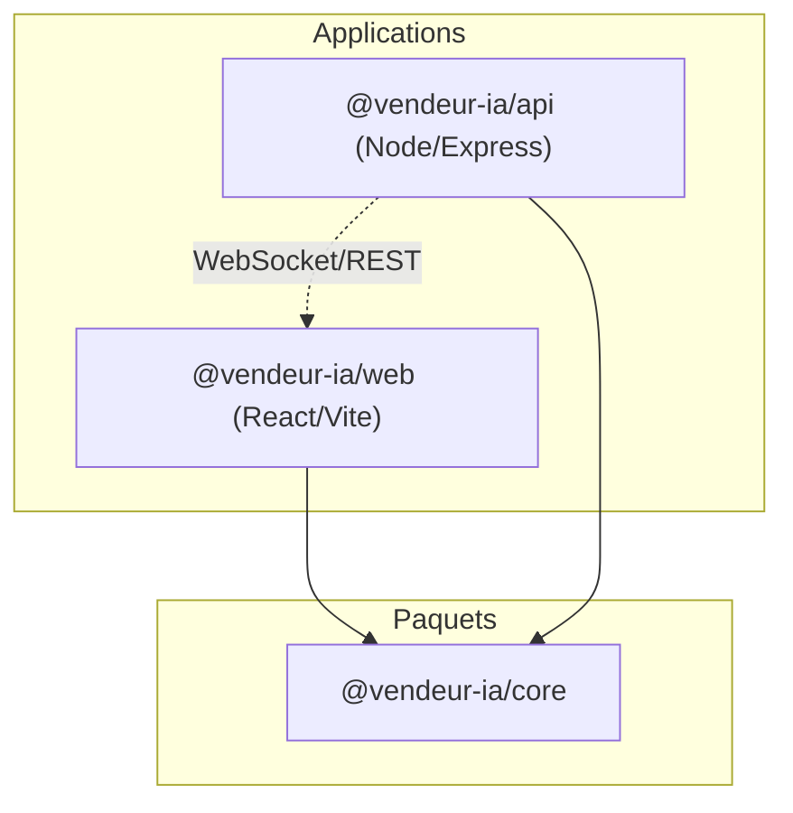
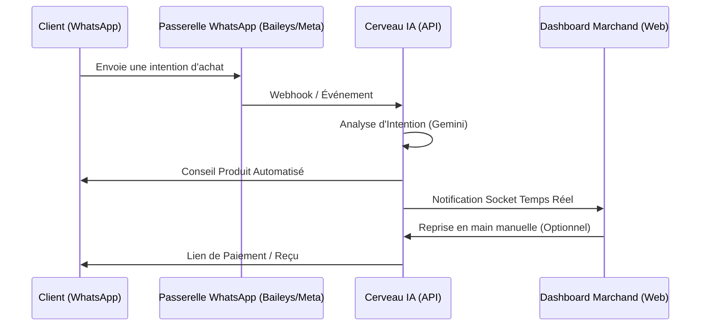

# 🏗️ Vue d'Ensemble du Système - Vendeur IA OS

Vendeur IA est un système d'exploitation commercial (OS) spécialisé pour le Social Commerce sur le marché africain. Il fait le pont entre le commerce traditionnel et le commerce conversationnel en utilisant l'IA pour gérer les ventes directement sur WhatsApp, Instagram et TikTok.

## 🏢 Architecture Monorepo

Le projet est géré comme un monorepo **Turborepo**, garantissant une séparation stricte des responsabilités et le partage de code.

### 📦 Composants
- **`@vendeur-ia/core`** : Contient les schémas Zod, les contrats de données et la logique de validation partagée.
- **`@vendeur-ia/api`** : Le "Cerveau" du système. Gère l'orchestration de l'IA, le traitement des paiements, la gestion des sessions WhatsApp et la logique métier.
- **`@vendeur-ia/web`** : Une application React mobile-first, construite avec Framer Motion pour une expérience premium.

---

## 🔄 Flux de Données Principal

Vendeur IA fonctionne sur une **Architecture Orientée Événements** pour le commerce en temps réel.

---

## 🛠️ Stack Technique

| Couche | Technologie |
| :--- | :--- |
| **Langage** | TypeScript (Mode Strict) |
| **Backend** | Node.js, Express, MongoDB (Mongoose) |
| **Frontend** | React, Vite, Tailwind CSS, Framer Motion |
| **Gestion d'État** | TanStack Query (React Query) |
| **Moteur IA** | Google Gemini 1.5 Pro/Flash |
| **Temps Réel** | Socket.io |
| **Paiements** | Paystack (Abonnements & Mobile Money Local) |
| **Communication** | Baileys (WA), Meta Graph API (IG/FB) |
