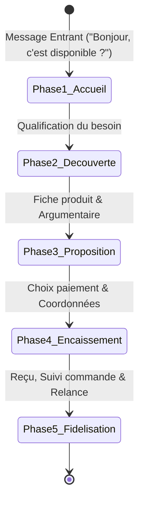

# 🛍️ Tunnel de Vente Conversationnel - Vendeur IA OS

Ce document détaille les étapes du cycle de vente conversationnel automatisé sur WhatsApp, Instagram et TikTok.

---

## 🎯 1. Les 5 Phases du Tunnel Conversationnel

---

## 💬 2. Détail des Phases

### Phase 1 : Accueil & Détection d'Intention
- L'IA identifie immédiatement la langue et la tonalité de l'acheteur.
- Salutation chaleureuse avec la personnalité définie par le marchand (pro, amical, chaleureux).

### Phase 2 : Découverte & Qualification
- Détection des critères clés : taille, pointure, couleur, quantité, zone géographique de livraison.
- Consultation en temps réel du catalogue pour vérifier la disponibilité en stock.

### Phase 3 : Proposition de Valeur & Recommandation
- Envoi de la photo du produit, de la description persuasive et du prix dans la devise locale.
- Gestion des objections courantes (prix, qualité, délais de livraison).

### Phase 4 : Prise de Commande & Encaissement
- Récupération des informations de livraison (nom, numéro de téléphone, commune/ville, point de repère).
- Proposition des modes de paiement configurés par le marchand (Wave, Orange Money, MTN, Paiement à la livraison).
- Validation immédiate via **PaymentShield** dès l'envoi de la preuve de paiement.

### Phase 5 : Reçu & Relance Automatisée
- Génération d'un reçu d'achat au format texte et PDF avec récapitulatif.
- Notification au marchand avec synthèse de la commande.
- Relance automatique et courtoise en cas de panier non finalisé après un délai configuré (ex: 2 heures).
