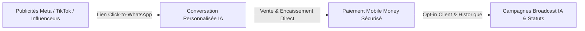

# 📢 Stratégie Social Commerce & Croissance - Vendeur IA OS

Ce document présente les axes marketing, le positionnement stratégique et les leviers de conversion pour le Social Commerce en Afrique et sur les marchés émergents.

---

## 🎯 1. Le Contexte & L'Opportunité de Marché

En Afrique subsaharienne et dans le monde francophone :
- **WhatsApp est le véritable navigateur Internet** : Plus de 80% des interactions commerciales informelles et e-commerce s'effectuent par messagerie instantanée.
- **La friction du panier classique** : Les sites e-commerce traditionnels enregistrent des taux d'abandon très élevés (absence de confiance, formulaires complexes, manque d'assistance humaine immédiate).
- **Le besoin d'instantanéité** : Un client qui pose la question *"C'est combien ?"* ou *"C'est disponible ?"* achète auprès du premier vendeur qui répond de manière personnalisée et rassurante.

---

## 🚀 2. Les Piliers d'Acquisition & Rétention Vendeur IA

### 1. Du Clic publicitaire à la Vente (Click-to-WhatsApp)
- Connexion directe des publicités Facebook, Instagram et TikTok vers le numéro WhatsApp du marchand.
- Prise en charge immédiate à la milliseconde par Vendeur IA avec qualification du produit visualisé.

### 2. Le Studio Créatif IA
- Génération automatisée d'affiches publicitaires percutantes adaptées aux formats Story et Statut WhatsApp.
- Rédaction de textes promotionnels engageants respectant les codes culturels locaux.

### 3. Les Campagnes Broadcast Intelligentes
- Segmentation automatique des clients (acheteurs réguliers, paniers abandonnés, clients inactifs).
- Envoi de promotions ciblées et d'offres exclusives via WhatsApp sans spam.
