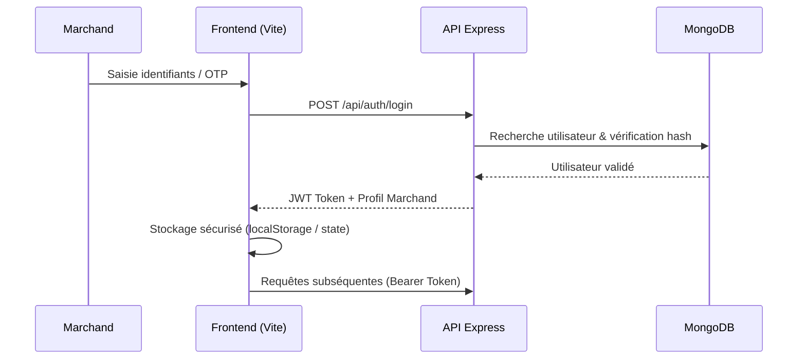
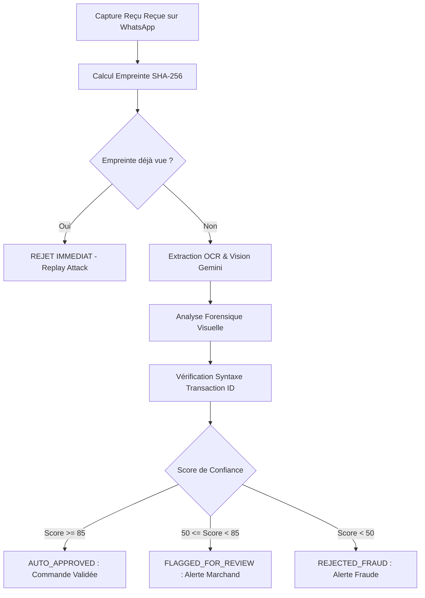

# 🛡️ Sécurité & Conformité - Vendeur IA OS

Ce document détaille l'architecture de sécurité, les protocoles d'authentification, l'isolation des données marchandes et les mécanismes anti-fraude mis en œuvre sur la plateforme Vendeur IA.

---

## 🔐 1. Authentification & Gestion des Sessions

Vendeur IA met en œuvre une authentification sans friction adaptée aux usages du commerce mobile en Afrique (téléphone/WhatsApp ou email/mot de passe).

### Mécanismes d'Authentification
- **Authentification par Numéro de Téléphone (OTP / WhatsApp)** : Validation en temps réel avec jeton sécurisé à durée de vie limitée (5 minutes).
- **Authentification Email / Mot de Passe** : Hachage fort des mots de passe avec `bcrypt` (10 rounds de salage).
- **Jetons d'Accès JWT** :
  - `Access Token` : Signé via HMAC-SHA256 avec une expiration courte (24h).
  - Transmission sécurisée via en-tête HTTP `Authorization: Bearer <token>`.
  - Middleware de vérification strict [`apps/api/src/middleware/authenticate.ts`](file:///C:/Users/Franck/web-apps/vendeur-ia/apps/api/src/middleware/authenticate.ts).

---

## 🏢 2. Isolation Multi-Tenant (Cloisonnement des Données)

Dans Vendeur IA, chaque boutique est isolée de manière logique et stricte :

1. **Association obligatoire `merchantId`** :
   - Tout modèle de données lié aux opérations (`Product`, `Order`, `Conversation`, `Knowledge`, `Customer`, `Transaction`) possède une clé étrangère indexée `merchantId`.
2. **Filtrage automatique au niveau des contrôleurs & services** :
   - L'identifiant du marchand est extrait directement du jeton JWT authentifié (`req.user.merchantId` ou `req.user.userId`).
   - Aucune requête ne permet de lister ou modifier les données d'un autre tenant sans droits d'administration explicites (`role === "founder"` ou `role === "admin"`).
3. **Audit Log & Traçabilité** :
   - Les actions sensibles (modifications de prix, activation de passerelles, remboursements) sont consignées dans [`AuditLogModel`](file:///C:/Users/Franck/web-apps/vendeur-ia/apps/api/src/modules/commerce/audit-log.model.ts).

---

## 🛡️ 3. PaymentShield Forensic™ (Détection Anti-Fraude Mobile Money)

Le système **PaymentShield Forensic** protège les marchands contre les fausses captures d'écran de paiement Mobile Money (Wave, Orange Money, MTN Moov).

### Critères de détection forensique :
- **Anti-Replay** : Calcul du hash SHA-256 du buffer de l'image pour bloquer instantanément les captures réutilisées.
- **Analyse des artefacts de retouche** : Détection des polices non alignées, des artefacts de compression JPEG localisés et des incohérences d'interface UI.
- **Vérification syntaxique des opérateurs** :
  - **Wave** : Format alphanumérique standard (ex: `T-XXXXX` ou `W-XXXXX`).
  - **Orange Money** : Identifiant numérique ou alphanumérique horodaté (ex: `CI...` ou format standard 10-14 chiffres).
  - **MTN Moov** : Regex spécifique de validation des identifiants de transaction.

---

## 📲 4. Sécurité des Passerelles WhatsApp & Médias

1. **Sessions WhatsApp Baileys** :
   - Les clés d'authentification et tokens de session multi-device sont chiffrés et stockés dans un répertoire sécurisé non public (`storage/whatsapp-sessions/`).
2. **Meta Cloud API (Numéros Officiels)** :
   - Validation stricte du webhook secret via le token de vérification Meta (`HUB_VERIFY_TOKEN`).
   - Validation de la signature cryptographique `X-Hub-Signature-256` sur tous les webhooks entrants.
3. **Traitement et assainissement des fichiers médias** :
   - Upload limité aux formats autorisés (`image/jpeg`, `image/png`, `image/webp`, `audio/ogg`, `audio/mp4`).
   - Limitation de taille (10 MB maximum par fichier).
   - Stockage avec noms de fichiers aléatoires hachés pour éviter l'écrasement ou l'exécution de scripts malveillants.

---

## 🔒 5. Variables d'Environnement & Secrets

- Toutes les clés sensibles (`JWT_SECRET`, `MONGODB_URI`, `GEMINI_API_KEY`, `WHATSAPP_TOKEN`, etc.) sont validées au démarrage via Zod dans [`apps/api/src/config/env.ts`](file:///C:/Users/Franck/web-apps/vendeur-ia/apps/api/src/config/env.ts).
- En cas de variable manquante ou invalide, l'application refuse de démarrer pour prévenir tout comportement indéfini.
