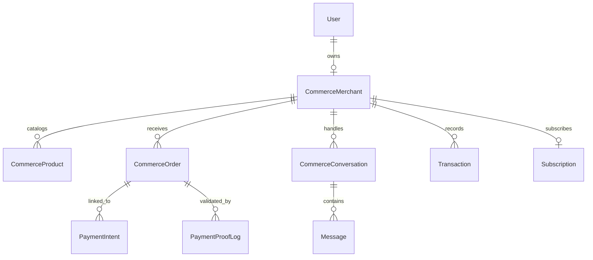

# 🗄️ Base de Données & Modèles - Vendeur IA OS

Ce document présente l'architecture de données de Vendeur IA basée sur **MongoDB (Mongoose)**, la modélisation des entités clés et leurs relations métier.

---

## 📐 1. Vue d'Ensemble du Schéma

---

## 📋 2. Modèles Principaux

### 👤 Utilisateur (`User`)
- **Fichier** : [`apps/api/src/modules/auth/user.model.ts`](file:///C:/Users/Franck/web-apps/vendeur-ia/apps/api/src/modules/auth/user.model.ts)
- **Rôle** : Gère l'identité, l'accès, le rôle (`merchant`, `founder`, `admin`) et les moyens d'authentification (email, téléphone, WhatsApp).

### 🏪 Marchand (`CommerceMerchant`)
- **Fichier** : [`apps/api/src/modules/commerce/commerce.model.ts`](file:///C:/Users/Franck/web-apps/vendeur-ia/apps/api/src/modules/commerce/commerce.model.ts)
- **Champs essentiels** :
  - `ownerId` : Référence de l'utilisateur propriétaire.
  - `businessName` & `category` : Nom et catégorie commerciale (mode, cosmétique, électronique, etc.).
  - `country`, `city`, `currency` : Localisation et devise (ex: `CI`, `Abidjan`, `XOF`).
  - `aiSettings` : Personnalité de l'agent, style de réponse, tutoiement/vouvoiement, activation de la réponse automatique.
  - `paymentChannels` : Canaux de paiement configurés (Wave, Orange Money, MTN, Moov, Espèces).

### 📦 Produit (`CommerceProduct`)
- **Fichier** : [`apps/api/src/modules/commerce/commerce.model.ts`](file:///C:/Users/Franck/web-apps/vendeur-ia/apps/api/src/modules/commerce/commerce.model.ts)
- **Champs essentiels** :
  - `merchantId` : Référence au marchand.
  - `name`, `description`, `price`, `compareAtPrice` : Informations tarifaires et descriptives.
  - `stock` : Quantité disponible en stock (mise à jour automatique lors des commandes).
  - `images` : URLs des photos produits.
  - `isActive` : Visibilité dans le catalogue IA.

### 🛒 Commande (`CommerceOrder`)
- **Fichier** : [`apps/api/src/modules/commerce/order.model.ts`](file:///C:/Users/Franck/web-apps/vendeur-ia/apps/api/src/modules/commerce/order.model.ts)
- **Statuts supportés** : `pending`, `confirmed`, `paid`, `shipped`, `delivered`, `cancelled`.
- **Champs essentiels** :
  - `orderNumber` : Référence unique (ex: `CMD-2026-8921`).
  - `items` : Liste des produits, quantités et prix unitaires.
  - `customer` : Nom, numéro WhatsApp, adresse de livraison et ville.
  - `totalAmount` & `currency` : Montant total calculé.
  - `paymentStatus` : `unpaid`, `pending_verification`, `paid`, `refunded`.

### 💬 Conversation & Messages (`CommerceConversation` / `Message`)
- **Fichiers** : [`apps/api/src/modules/commerce/commerce.model.ts`](file:///C:/Users/Franck/web-apps/vendeur-ia/apps/api/src/modules/commerce/commerce.model.ts)
- **Rôle** : Historique des échanges WhatsApp/Instagram/Web Chat.
- **Délégation** : Drapeau `isHandledByHuman` permettant le passage instantané entre l'agent IA autonome et le marchand.

---

## ⚡ 3. Indexation & Optimisations de Performance

Pour garantir des réponses sous les 200 ms même avec un grand volume de messages :
- Index composé `{ merchantId: 1, createdAt: -1 }` sur toutes les collections opérationnelles.
- Index unique `{ ownerId: 1 }` sur `CommerceMerchant`.
- Index `{ customerPhone: 1, merchantId: 1 }` sur les conversations pour un routage instantané des webhooks WhatsApp.
