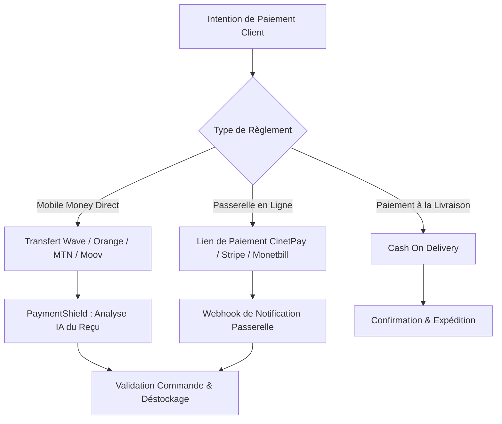

# 💳 Intégrations des Paiements & Mobile Money - Vendeur IA OS

Ce document présente l'architecture des paiements, la gestion des devises africaines et internationales, et le fonctionnement des encaissements directs et automatisés sur Vendeur IA.

---

## 🌍 1. Devises Supportées & Taux de Conversion

Vendeur IA intègre nativement une table de conversion et d'arrondis marchands pour toute l'Afrique francophone, anglophone et le marché international :

| Devise | Symbole | Marché Principal | Arrondi Commercial |
| :--- | :--- | :--- | :--- |
| **XOF** | CFA | Côte d'Ivoire, Sénégal, Mali, Burkina Faso, Togo, Bénin, Niger, Guinée-Bissau | 500 CFA |
| **XAF** | FCFA | Cameroun, Gabon, Congo, Tchad, Centrafrique, Guinée Équatoriale | 500 FCFA |
| **GNF** | FG | Guinée | 5 000 FG |
| **CDF** | FC | République Démocratique du Congo | 500 FC |
| **NGN** | ₦ | Nigéria | 100 ₦ |
| **GHS** | GH₵ | Ghana | 5 GH₵ |
| **EUR / USD** | € / $ | Diaspora / International | 1 € / 1 $ |

---

## 🔄 2. Types de Paiements

### A. Mobile Money Direct (Pair-à-Pair)
1. Le client reçoit les coordonnées de paiement du marchand (ex: numéro Wave ou Orange Money).
2. Le client effectue son transfert et envoie la capture du reçu ou le SMS de confirmation dans la conversation WhatsApp.
3. Le module **PaymentShield** analyse instantanément le reçu, extrait le montant, la date, l'opérateur et l'identifiant de transaction, et valide la commande.

### B. Passerelles Automatisées & Liens de Paiement
- Génération dynamique de liens de paiement sécurisés avec référence unique (`VIA-XXXX-XXXX`).
- Prise en charge des webhooks avec validation cryptographique et mise à jour en temps réel via Socket.io.

### C. Paiement à la Livraison (Cash On Delivery)
- L'agent IA recueille l'adresse précise, le quartier et un repère géographique.
- La commande est enregistrée avec le statut `pending_cod` et notifiée immédiatement au marchand pour expédition.

---

## 🔒 3. Cycle de Vie d'un `PaymentIntent`

1. **Création (`created`)** : Génération de l'intention avec montant, devise, marchand et panier.
2. **En attente de preuve (`awaiting_proof`)** : Le client procède au paiement.
3. **Analyse (`verifying`)** : Traitement par l'OCR forensique de vision Gemini.
4. **Approuvé (`completed`)** : Décrémentation automatique du stock produit et notification push/sonore au marchand.
5. **Rejeté / Expiré (`failed` / `expired`)** : Alerte au client avec possibilité de renvoyer une preuve valide.
