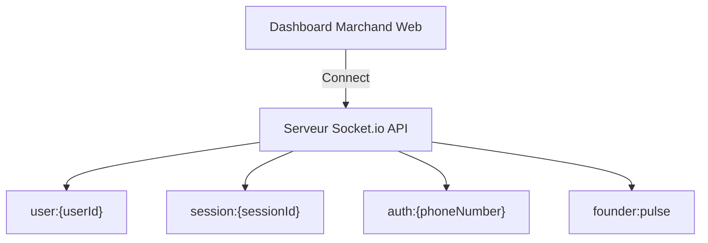

# ⚡ Temps Réel & WebSockets - Vendeur IA OS

Ce document décrit l'architecture WebSocket basée sur **Socket.io** pour la synchronisation instantanée des messages, des alertes de vente et de la reprise en main marchand.

---

## 📡 1. Architecture des Salons (Rooms)

Le serveur WebSocket gère des salons isolés par utilisateur et par session pour garantir une distribution sécurisée et ciblée des événements :

### Salons Principaux :
- **`user:{userId}`** : Reçoit les notifications privées du marchand (nouvelle commande, message reçu, alerte de paiement).
- **`session:{sessionId}`** : Utilisé pour le Web Chat et le suivi du statut de connexion (en ligne / hors ligne).
- **`auth:{phoneNumber}`** : Permet la validation instantanée des connexions par QR Code ou OTP WhatsApp sans rechargement de page.
- **`founder:pulse`** : Salon haute priorité réservé à l'équipe fondatrice pour les métriques globales et les alertes critiques.

---

## 🔔 2. Principaux Événements Émis & Écoutés

| Événement | Direction | Payload Type | Description |
| :--- | :--- | :--- | :--- |
| `message:new` | Serveur ➔ Client | `IMessage` | Nouveau message reçu d'un client WhatsApp/Instagram |
| `order:new` | Serveur ➔ Client | `IOrder` | Nouvelle commande créée avec calcul de commission |
| `payment:proof_analyzed` | Serveur ➔ Client | `ForensicResult` | Résultat de l'analyse PaymentShield (Approuvé/Fraude) |
| `takeover:toggle` | Client ➔ Serveur | `{ conversationId, isHuman }` | Prise en main humaine ou réactivation de l'IA |
| `copilot:alert` | Serveur ➔ Client | `{ text, actions }` | Suggestion d'action intelligente émise par le Copilote |

---

## 🛑 3. Reprise en Main Humaine (Human Takeover)

Lorsqu'un marchand décide d'intervenir manuellement dans une conversation :
1. Le marchand clique sur le bouton **"Prendre la main"** dans l'interface Inbox.
2. L'événement `takeover:toggle` avec `isHuman: true` est émis vers l'API.
3. Le serveur bascule immédiatement le flag `isHandledByHuman = true` dans la base de données.
4. L'agent IA suspend automatiquement ses réponses automatiques sur ce fil de discussion pour laisser le marchand échanger librement.
5. Le marchand peut réactiver l'IA à tout moment en un clic.
